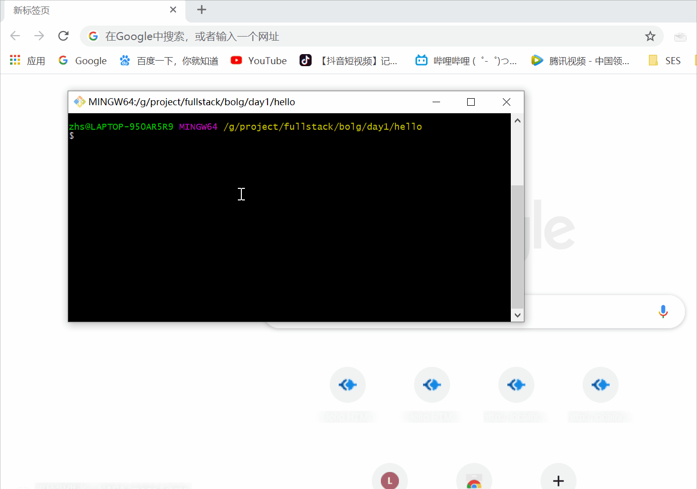

# [Day1] Node.js访问index.html

[TOC]

## 要求

- 了解JavaScript和html基础知识
- 了解node.js常用模块：http,fs

## 环境

1. OS: Win10
2. Node.js: v12.19.0
3. Notepad++

## 安装 [Node.js](https://nodejs.org/)

## 实战

1. 编写一个简单index.html文件.

```html
<!DOCTYPE html>
<html lang="en">
	<head>
		<meta charset="UTF-8">
			<title>Hello HTML</title>
		</head>
		<body>
			<h1>看到这句话表示html页面成功显示了。</h1>
		</body>
	</head>
</html>
```

2. 编写index.js

```javascript
var http=require("http")
var fs=require("fs")

http.createServer(function (req, res) {
	fs.readFile("./index.html",function (err,data){
		if(err){
			res.writeHead(404, {"Content-Type": "text/html"});
            res.end("<h1>404 Not Found</h1>");
			return;
	}else{
			res.writeHead(200,{"Content-Type": "text/html"});
		    res.end(data);
		}		
	});
}).listen(3000);
console.log("Server running at localhost:3000");
```

3. 运行index.js

```shell
node index.js
```

4. 浏览器看效果，及整个过程




