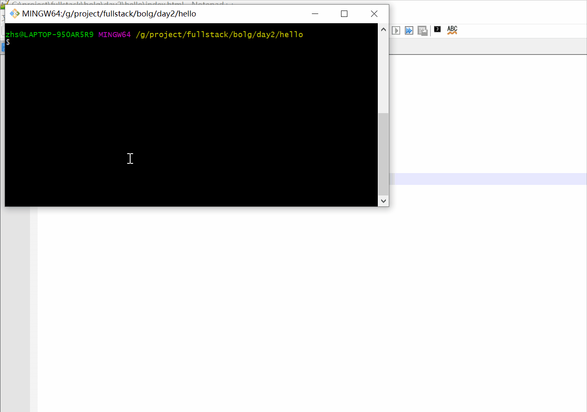

# [Day2] Node.js利用Express访问index.html

[TOC]

## 要求

- 了解Express框架
- 了解JavaScript和html基础知识
- 了解node.js常用模块：http,fs,express
- 了解require, exports

## 环境

1. OS: Win10
2. Node.js: v12.19.0
3. Notepad++
4. Express: v4.17.1

## 实战

1. 编写一个简单index.html文件.

```html
<!DOCTYPE html>
<html lang="en">
	<head>
		<meta charset="UTF-8">
			<title>Hello HTML</title>
		</head>
		<body>
			<h1>看到这句话表示html页面成功显示了。</h1>
		</body>
	</head>
</html>
```

2. 编写index.js

```javascript
var app=require("./server")

app.listen(3000);
console.log("Server running at localhost:3000");
```

3. 编写server.js

   ```javascript
   var express=require("express");
   var path=require("path");
   var app=express();
   
   app.get('/', (req, res) => {    
   	var options = {
           root: __dirname,    
   		headers: {
   		  "Content-Type": "text/html"
   		}
   	}
   	res.sendFile('index.html',options, function(error){
   		if(error){
   			console.log('Sent failed:', 'index.html' + error);
   		}else{
   			console.log('Sent sucess:', 'index.html');
   		}
   	});
   });
   
   module.exports = app;
   ```

4. install Express

   ```shell
   npm install express
   ```

5. 运行index.js

```shell
node index.js
```

6. 浏览器看效果，及整个过程




