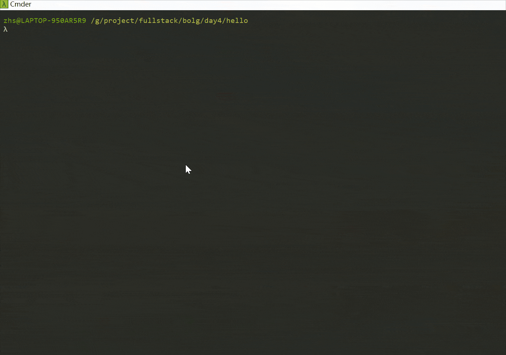

# [Day4] Node.js利用Express实现上传单文件

[TOC]

## 要求

- 了解Express框架
- 了解JavaScript和html,CSS基础知识
- 了解node.js常用模块：express
- **了解multer中间件**

## 环境

1. OS: Win10
2. Node.js: v12.19.0
3. Express: v4.17.1
5. Yarn: v1.22.10
5. **Multer: v1.4.2**
6. **使用VScode IDE**

## 原理

上传文件的from表单，则需要将form标签设置enctype="multipart/form-data"属性，是将Content-Type设置成multipart/form-data。默认类型是application/x-www-form-urlencoded，但是它不适合传输大型二进制数据，而multipart/form-data可以更有效的传输文件

文件上传本质上是一个**POST**请求。只不过请求头以及请求内容遵循一定的协议，请求头（Request Headers）中需要设置 Content-Type为 multipart/form-data; boundary=${boundary}

[**Multer**](https://github.com/expressjs/multer)

> Multer is a node.js middleware for handling `multipart/form-data`, which is primarily used for uploading files. It is written on top of [busboy](https://github.com/mscdex/busboy) for maximum efficiency.

**NOTE**: Multer will not process any form which is not multipart(`multipart/form-data`).

## 实战

**NOTE**:  *基于**Day3**的工程，只列出变化的部分*

### index.html

更新index.html,引入from表单，action: **/file/uploader**,method: **POST**

```html
<!DOCTYPE html>
<html lang="en">
	<head>
		<meta charset="UTF-8">
			<title>Hello HTML</title>
			<link rel="stylesheet" type="text/css" href="/stylesheets/style.css" />
		</head>
		<body>
			<h3>单文件上传：</h3>
			选择一个文件上传: <br />
			<form action="/file/uploader" enctype="multipart/form-data" method="post">
				<input type="file" name="image" size="50" />
				<br />
				<button type="submit">上传</button>
			</form>
		</body>
	</head>
</html>
```

### server.js

编写server.js，直接使用express的中间件托管静态文件目录,指定上传文件目录**/public/upload/**。实现POST API：/file/uploader。

```javascript
var express=require("express");
var path=require("path");
var multer=require("multer");

var app=express();

const UPLOADPATH =path.join( __dirname , '/public/upload/');

app.use(multer({ dest: UPLOADPATH}).single('image'));
app.use(express.static('public'))
app.post("/file/uploader", function(req,res){
    console.dir(req.file);
    var resObj = {
        code: 1,
        des: '上传成功'
    };
    res.send(resObj);
})

module.exports = app;
```

### install multer

```shell
yarn add multer
```

### 运行index.js

```shell
node index.js
```

### 结果及演示

浏览器看效果及整个过程，*本次没有修改原始文件名*




