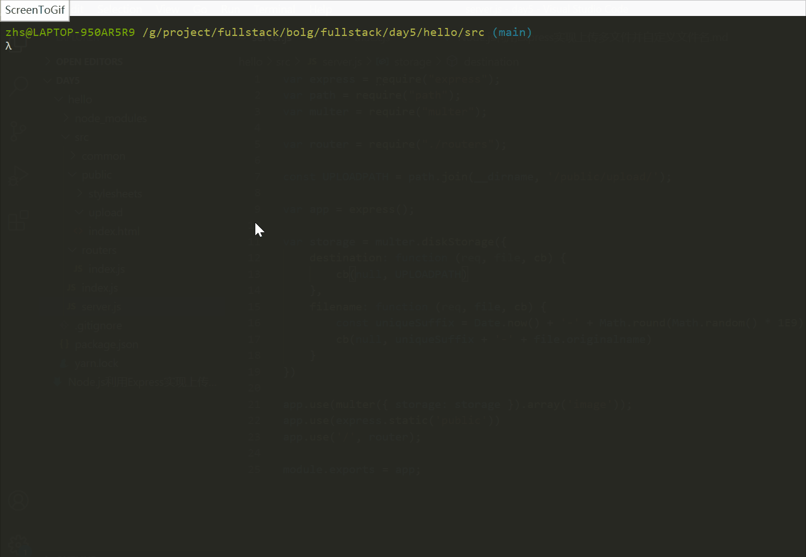

# [Day5] Node.js利用Express实现上传多个文件并自定义文件名

[TOC]

## 要求

- 了解Express框架
- 了解JavaScript和html,CSS基础知识
- 了解node.js常用模块：express
- **了解multer中间件**
- **了解express Router**

## 环境

1. OS: Win10
2. Node.js: v12.19.0
3. Express: v4.17.1
5. Yarn: v1.22.10
5. **Multer: v1.4.2**
6. **使用VScode IDE**

## 原理

[**Multer**](https://github.com/expressjs/multer)

使用`.array(fieldname[, maxCount])`和`DiskStorage`实现多文件及文件存储命名。

## 实战

**NOTE**:  *基于**Day4**的工程，只列出变化的部分*, 重新组织代码结构

### index.html

增加2个file type

```html
<!DOCTYPE html>
<html lang="en">
	<head>
		<meta charset="UTF-8">
			<title>Hello HTML</title>
			<link rel="stylesheet" type="text/css" href="/stylesheets/style.css" />
		</head>
		<body>
			<h3>3文件上传：</h3>
			选择文件上传: <br />
			<form action="/file/uploader" enctype="multipart/form-data" method="post">
				<input type="file" name="image" size="50" />
				<br />
				<input type="file" name="image" size="50" />
				<br />			
				<input type="file" name="image" size="50" />
				<br />
				<button type="submit">上传</button>
			</form>
		</body>
	</head>
</html>
```

### server.js

更改multer为multer.diskStorage，自定义上传路径及文件名。

```javascript
var express = require("express");
var path = require("path");
var multer = require("multer");

var router = require("./routers");

const UPLOADPATH = path.join(__dirname, '/public/upload/');

var app = express();

var storage = multer.diskStorage({
    destination: function (req, file, cb) {
        cb(null, UPLOADPATH)
    },
    filename: function (req, file, cb) {
        const uniqueSuffix = Date.now() + '-' + Math.round(Math.random() * 1E9)
        cb(null, uniqueSuffix + '-' + file.originalname)
    }
})

app.use(multer({ storage: storage }).array('image'));
app.use(express.static('public'))
app.use('/', router);

module.exports = app;
```

### Router

> A `router` object is an isolated instance of middleware and routes. You can think of it as a “mini-application,” capable only of performing middleware and routing functions. Every Express application has a built-in app router.
>
> A router behaves like middleware itself, so you can use it as an argument to [app.use()](http://expressjs.com/en/api.html#app.use) or as the argument to another router’s [use()](http://expressjs.com/en/api.html#router.use) method.

新建router/index.js

```javascript
var express=require("express");

var router=express.Router();

router.post("/file/uploader", function(req,res){
    console.dir(req.files);
    var resObj = {
        code: 1,
        des: '上传成功'
    };
    res.send(resObj);
})

module.exports = router;

```

### 运行index.js

```shell
node index.js
```

### 结果及演示

浏览器看效果及整个过程。




