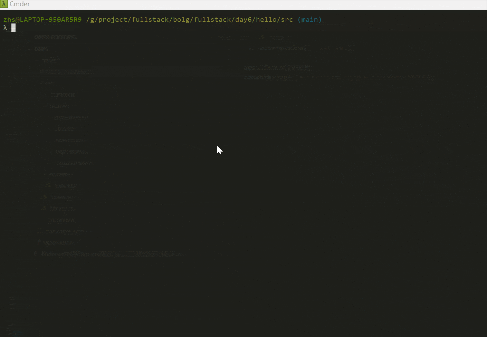

# [Day6] Node.js利用Express实现用户注册登陆功能

[TOC]

## 要求

- 了解Express框架
- 了解node.js常用模块：express，**body-parser**
- **了解express Router**
- 了解HTML **form**表单

## 环境

1. OS: Win10
2. Node.js: v12.19.0
3. Express: v4.17.1
5. Yarn: v1.22.10
6. **使用VScode IDE**
6. **body-parser**：1.19.0

## 原理

Form 表单

enctype: 表单数据提交时使用的**编码类型**，默认使用`"application/x-www-form-urlencoded"`，如果是使用POST请求，则请求头中的content-type指定值就是该值。enctype为form表单数据的编码格式，Content-type为Http传输的数据的编码格式

## 实战

### index.html

新增2个page, login.html, regisster.html.

```html
<!DOCTYPE html>
<html lang="en">
	<head>
		<meta charset="UTF-8">
			<title>登陆注册</title>
			<link rel="stylesheet" type="text/css" href="/stylesheets/style.css" />
		</head>
		<body>
			<a href="./register.html">注册</a>
			<a href="./login.html">登录</a>
		</body>
	</head>
</html>
```

### login.html

```html
<!DOCTYPE html>
<html lang="en">
	<head>
		<meta charset="UTF-8">
			<title>登陆注册</title>
			<link rel="stylesheet" type="text/css" href="/stylesheets/style.css" />
		</head>
		<body>
			<form action="/login" method="GET" >        
				<label for="">账号:</label> 
				<input name="user" type="text" placeholder="请输入账号"> 
				<br> 
				<label for="">密码:</label> 
				<input type="password" name="password" placeholder="请输入密码"> 
				<br>
				<input type="submit"  value="登录">
			</form>
		</body>
	</head>
</html>
```

### register.html

```html
<!DOCTYPE html>
<html lang="en">
	<head>
		<meta charset="UTF-8">
			<title>登陆注册</title>
			<link rel="stylesheet" type="text/css" href="/stylesheets/style.css" />
		</head>
		<body>
			<form action="/register" method="POST">
				<label for="">账号:</label> 
				<input name="user" type="text" placeholder="请输入账号">
				<br> 
				<label for="">密码:</label> 
				<input name="psw" type="password" placeholder="请输入密码"> 
				<br> 
				<label for="">重复密码:</label> 
				<input name="pswa" type="password" placeholder="请重复密码"> 
				<br> 
				<input type="submit" value="注册">
			</form>
		</body>
	</head>
</html>
```

### server.js

引入body-parser

```javascript
var express = require("express");
var bodyParser = require("body-parser");
var router = require("./routers");

var app = express();

app.use(bodyParser.urlencoded({ extended: true }));
app.use(express.static('public'));
app.use('/', router);

module.exports = app;
```

### Router

router/index.js

```javascript
var express=require("express");

var router=express.Router();

router.get("/login", function(req,res){
    console.dir(req.query);    
    res.send(`${req.query.user}:登陆成功`);
})

router.post("/register", function(req,res){
    console.dir(req.body);    
    res.send(`${req.body.user}: 注册成功`);
})
module.exports = router;

```

### 运行index.js

```shell
node index.js
```

### 结果及演示

浏览器看效果及整个过程。


